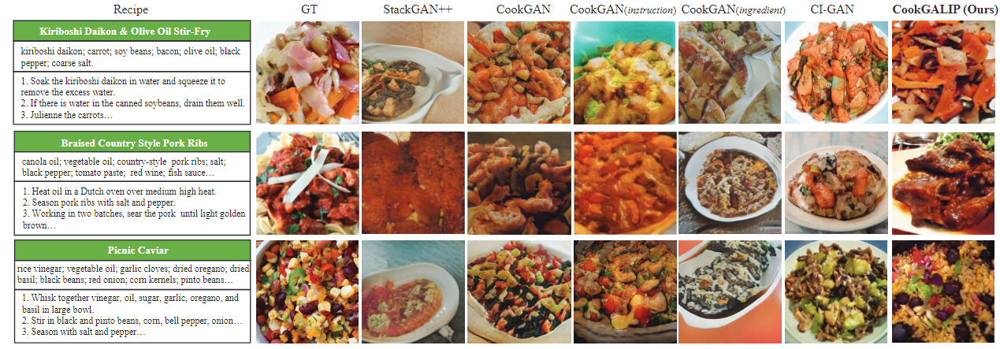

<!-- # magic-edit.github.io -->
<p align="center">
  <h2 align="center">CookGALIP: Recipe Controllable Generative Adversarial CLIPs with Sequential Ingredient Prompts for Food Image Generation</h2>
  <p align="center">
    <a href="https://scholar.google.com.hk/citations?user=8Iw1MyUAAAAJ&hl=zh-CN"><strong>Mengling Xu, </strong></a>
    <a href="https://scholar.google.com.hk/citations?user=Kp_76nYAAAAJ&hl=zh-CN&oi=ao"><strong>Jie Wang, </strong></a>
    <a href="https://scholar.google.com/citations?user=5GlOlNUAAAAJ"><strong>Ming Tao, </strong></a>
    <a href="https://scholar.google.com/citations?user=lDppvmoAAAAJ&hl=en"><strong>Bing-Kun Bao<sup>*</sup>, </strong></a>
    <a href="https://scholar.google.com/citations?user=hI9NRDkAAAAJ"><strong>Changsheng Xu </strong></a>
    <br>
      <a href="https://ieeexplore.ieee.org/document/10474191">
      </a>
      <a></a>
      <a></a>
    </br>
  </p>
</p>

## Overview
Generated images.
<p align="center">
    
</p>

This is an official Pytorch implementation for our paper "[CookGALIP: Recipe Controllable Generative Adversarial CLIPs with Sequential Ingredient Prompts for Food Image Generation](https://ieeexplore.ieee.org/document/10474191)".
## Getting started
### Requirements:
```
git clone https://github.com/NJUPT-MCC/CookGALIP
pip install -r requirements.txt
```
### Prepare Datasets:
#### Download:
Download the Recipe1M dataset from http://pic2recipe.csail.mit.edu/ \
Download the Vireo Food-172 dataset from http://vireo.cs.cityu.edu.hk/VireoFood172/

### Sample:
The <a href="https://github.com/NJUPT-MCC/CookGALIP/blob/main/src/test.py">src/test.py</a> can be used to sample food images.

### Evaluation: 
#### Download the npz file:
<a href="https://drive.google.com/file/d/1qcWUmZPIqvLRixeOXyeVHCcHScyYIA8M/view?usp=drive_link">Download</a> for Recipe1M. \
<a href="https://drive.google.com/file/d/1xPtH7xSuOE0LuwzuTlEfMMJhHkB1mJNu/view?usp=drive_link">Download</a> for Vireo Food-172. 
#### Download the pre-trained model:
<a href="https://drive.google.com/file/d/1yv-wNT3uIWiJauaIp3Y0K7ArnnDlEfhS/view?usp=drive_link">CookGALIP</a> for Recipe1M. \
<a href="https://drive.google.com/file/d/15erHEzKohh71sF1qhywQjqix0ATh5Fl4/view?usp=drive_link">CookGALIP</a> for Vireo Food-172.

## Citing

If you find our work is useful, please consider citing our paper:
```
@article{xu2024cookgalip,
  title={CookGALIP: Recipe Controllable Generative Adversarial CLIPs With Sequential Ingredient Prompts for Food Image Generation},
  author={Xu, Mengling and Wang, Jie and Tao, Ming and Bao, Bing-Kun and Xu, Changsheng},
  journal={IEEE Transactions on Multimedia},
  year={2024},
  publisher={IEEE}
}
```
The code is released for academic research use only.

## Acknowledgement
Code is based on <a href="https://github.com/tobran/GALIP">GALIP</a>, thanks for their contributions. Thank you for your patience!

